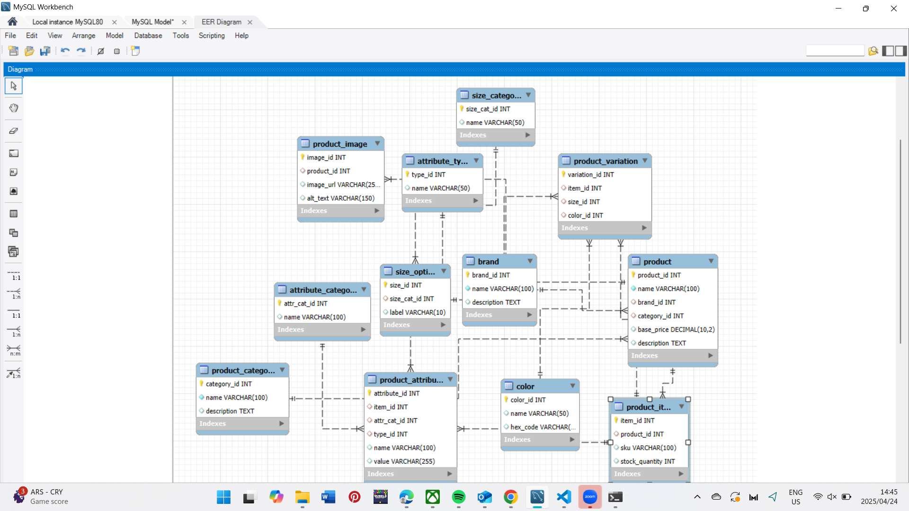

# 🛍️ E-commerce Database Design - Peer Group 538 Assignment

This project presents a relational database design for a simplified e-commerce platform. It covers core product management features including product variations, sizes, colors, images, and custom attributes.

---

## 📁 Contents

- `ecommerce.sql` – SQL script to create all tables and insert sample data.
- `ERD.png` – Entity-Relationship Diagram (ERD) for database structure.
- `README.md` – Project documentation (this file).

---

## 🧱 Database Tables Overview

| Table Name           | Description                                         |
|----------------------|-----------------------------------------------------|
| `brand`              | Stores brand information                            |
| `product_category`   | Groups products into categories                     |
| `product`            | Represents main products                            |
| `product_item`       | Specific purchasable product SKUs                   |
| `product_variation`  | Associates size/color with product items            |
| `color`              | Stores available color options                      |
| `size_category`      | Groups size options (e.g., clothing, shoes)         |
| `size_option`        | Specific size values                                |
| `product_image`      | Images related to products                          |
| `attribute_category` | Groups attributes like Physical or Technical        |
| `attribute_type`     | Type of attribute (Text, Number, Boolean)           |
| `product_attribute`  | Custom attributes for product items                 |

---

## 🔄 Relationships (Simplified)

- A `brand` has many `products`.
- A `product_category` has many `products`.
- A `product` has many `product_items`.
- A `product_item` has many `product_variations` and `product_attributes`.
- A `product_variation` maps a `size_option` and `color` to a `product_item`.
- A `size_option` belongs to a `size_category`.
- A `product_attribute` uses an `attribute_type` and `attribute_category`.
- A `product` has many `product_images`.

---

## 🚀 How to Use

1. Clone or download this repo.
2. Open MySQL Workbench or any MySQL-compatible DBMS.
3. Run `ecommerce.sql` to create the schema and populate it with sample data.
4. Use SQL queries to explore the schema, test joins, and simulate use cases.

---

## 🛠 Tools Used

- **MySQL**
- **GitHub** for version control and collaboration

---

## 📸 ERD Preview

---

## 👨‍💻 Author

Built by Group 538 as part of an academic and personal learning project.
